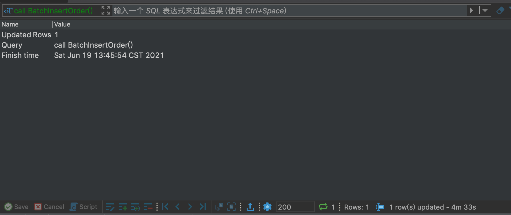
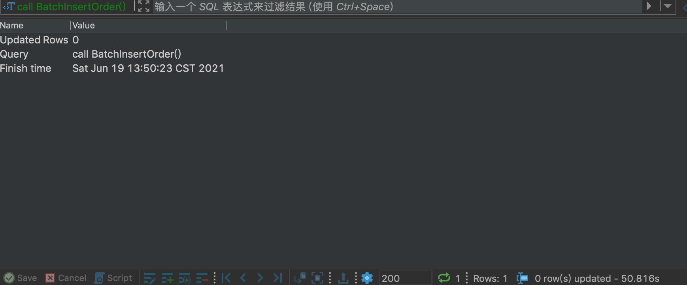
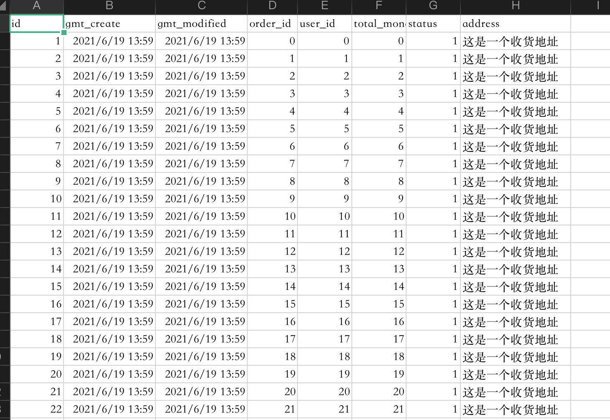
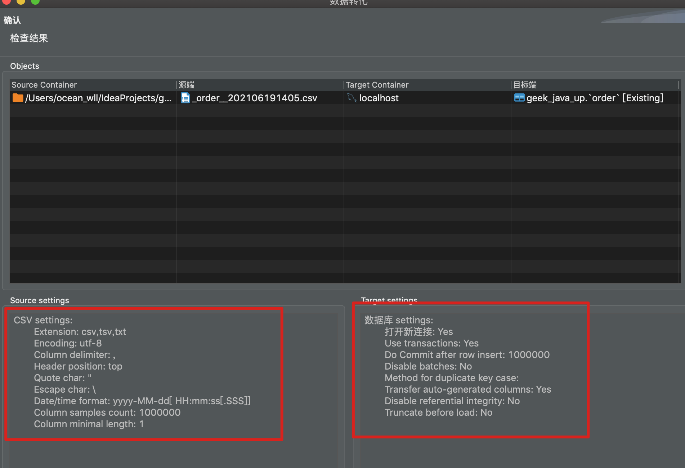

# 测试mysql单表插入100w数据性能


## DDL

```sql
CREATE TABLE `order` (
  `id` bigint unsigned NOT NULL AUTO_INCREMENT COMMENT '主键',
  `gmt_create` datetime NOT NULL DEFAULT CURRENT_TIMESTAMP COMMENT '创建时间',
  `gmt_modified` datetime NOT NULL DEFAULT CURRENT_TIMESTAMP COMMENT '修改时间',
  `order_id` varchar(32) NOT NULL COMMENT '订单id',
  `user_id` bigint unsigned NOT NULL COMMENT '用户id',
  `total_money` varchar(64) NOT NULL COMMENT '金额',
  `status` tinyint unsigned NOT NULL COMMENT '订单状态',
  `address` varchar(256) NOT NULL COMMENT '收货信息',
  PRIMARY KEY (`id`)
) ENGINE=InnoDB DEFAULT CHARSET=utf8mb4 COLLATE=utf8mb4_0900_ai_ci COMMENT='订单表'
```

## 一、存储过程

### 1、自动commit

```sql
CREATE PROCEDURE geek_java_up.BatchInsertOrder()
BEGIN
	declare i int;
    set i=0;
    while i<1000000 do
        INSERT INTO geek_java_up.order(order_id,user_id,total_money,status,address)  value(i,i,i,1,'这是一个收货地址');
        set i=i+1;
    end while;
END
```



插入一条数据自动提交一次事务，可以看到插入100w数据执行了 4分33秒。

### 2、手动commit

```sql
CREATE PROCEDURE geek_java_up.BatchInsertOrder()
BEGIN
	declare i int;
	set autocommit = 0;
	start transaction;
    set i=0;
    while i<1000000 do
        INSERT INTO geek_java_up.order(order_id,user_id,total_money,status,address)  value(i,i,i,1,'这是一个收货地址');
        set i=i+1;
    end while;
   	commit;
  	set autocommit = 1;
END
```



当手动开启事务并提交记录，可以明显发现执行速度快了很多，只有50.816s。

## 二、jdbc

``` java
    public static void main(String[] args) {

        Connection connection = null;
        PreparedStatement preparedStatement = null;
        ResultSet resultSet = null;

        try {
            // 1、注册驱动
            Class.forName("com.mysql.jdbc.Driver");
            // 2、获取连接
            String url = "jdbc:mysql://127.0.0.1:3306/geek_java_up";
            String userName = "root";
            String password = "root";

            connection = DriverManager.getConnection(url, userName, password);

            // 3、获取statement
            preparedStatement = connection.prepareStatement("INSERT INTO geek_java_up.order(order_id,user_id," +
                    "total_money,status,address)  value(?,?,?,1,'这是一个收货地址')");

            Long startTime = System.currentTimeMillis();
            // 关闭事务自动提交
            connection.setAutoCommit(false);
            for (int i = 0; i < 1000000; i++) {
                preparedStatement.setLong(1, i);
                preparedStatement.setLong(2, i);
                preparedStatement.setLong(3, i);
                preparedStatement.addBatch();
            }

            preparedStatement.executeBatch();

            //提交事务
            connection.commit();
            Long endTime = System.currentTimeMillis();
            System.out.println("执行时间为 " +(endTime - startTime)/1000 +" s");
        } catch (Exception e) {
            e.printStackTrace();
        } finally {
            //5.关闭资源
            try {
                if (resultSet != null) {
                    resultSet.close();
                }
                if (preparedStatement != null) {
                    preparedStatement.close();
                }
                if (connection != null) {
                    connection.close();
                }
            } catch (SQLException throwables) {
                throwables.printStackTrace();
            }
        }
    }
```


可以看到通过jdbc手动提交事务插入100w数据的执行时间是162s，比直接执行sql慢很多。

## 三、直接导入

先将前面插入的数据导出csv文件。

数据示例如下



开始数据导入，配置参数如下：




可以看到执行时间为3m49s

## 结论

都在手动提交事务的情况下，插入100w数据时间  存储过程 < jdbc < 可视化工具导入